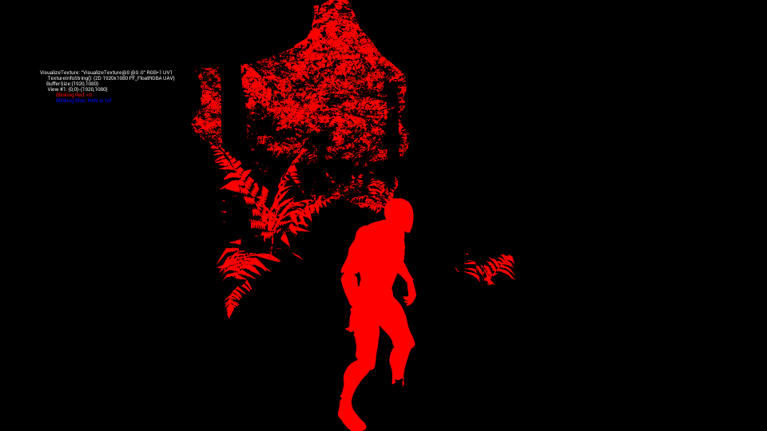

NVIDIA Real-Time Denoiser (NRD) Plugin
======================================

# Quickstart

Please see below for additional details

1. Enable the NRD plugin in the Editor, then restart the editor
2. Enable raytracig in the project settings
3. Enable RTXDI and NRD via the console variables/ DefaultEngine.ini of the project
   - r.RayTracing.SampledDirectLighting 1
   - r.RayTracing.SampledLighting.Denoiser 2

# Troubleshooting

- Issue: "Swimming" shadows on animated geometry such as foliage and grass
  - Remedy: Verify correct velocities/motion vectors via "vis NRD.Input.MotionVectors uv1". Make sure that grass & foliage and other animated meshes show up there. If not, see the section on section on [enabling motion vectors](#enabling-motion-vectors-for-nrd-denoisers) in this document
  - 

## System requirements

- Windows 10, 64 bit
- NVIDIA Geforce Driver
- NVIDIA RTX GPU (GeForce, Titan or Quadro) with [DLSS](https://www.nvidia.com/en-us/geforce/technologies/dlss/) support
- The ReLAX diffuse/specular denoiser is currently only supported by the NVIDIA RTXDI implementation in the following branches
  - TODO ADD BRANCH LINKS
- UE4 raytracing project, at this time supported by
  - DX12

## Verify Engine side plugin hooks

The following cvars should be set to enable RTXDI and the ReLAX denoiser
- Enable Raytracing (can also be done via the project settings)
  - r.SkinCache.CompileShaders 1
  - r.RayTracing 1
- Enable RTXDI and the NRD denoiser
  - r.RayTracing.SampledDirectLighting 1
  - r.RayTracing.SampledLighting.Denoiser 2

# Command Line Options And Console Variables and Commands
  
## Enabling Motion vectors for NRD denoisers
  
NRD requires correct motion vectors to function properly. The following console variables can be set to 1 and used to render motion vectors for all objects, and not just the ones with dynamic geometry. This can be useful if it's infeasible to e.g. change all meshes to stationary or dynamic.

- r.BasePassOutputsVelocity (0, default)
  - Enables rendering WPO velocities on the base pass.
  - 0: Renders in a separate pass/rendertarget, all movable static meshes + dynamic
  - 1: Renders during the regular base pass adding an extra GBuffer, but allowing motion blur on materials with Time-based WPO

- r.BasePassForceOutputsVelocity (0, default)
  - Force the base pass to compute motion vector, regardless of FPrimitiveUniformShaderParameters.
  - 0: Disabled
  - 1: Enabled
  
## NRD/ReLAX Runtime Image Quality Tweaks

The NRD/ReLAX diffuse specular denoiser provides a variety of console variables to tweak and tune it's image quality in concert with the RTXDI/ReSTIR direct lighting raytracing algorithm.

Please refere to the [ReLAX GTC presentation TODO UPDATE ULR](https://www.nvidia.com/en-us/geforce/technologies/dlss/) on technical details

- History
  - r.NRD.Relax.History.SpecularMaxAccumulatedFrameNum 
    - Amount of frames in history for specular signal temporal accumulation  [0 ... 63] (Default = 63) 
  - r.NRD.Relax.History.SpecularFastMaxAccumulatedFrameNum 
    - Amount of frames in history for responsive specular signal temporal accumulation  [0 ... 63] (Default = 4) 
  - r.NRD.Relax.History.DiffuseMaxAccumulatedFrameNum 
    - Amount of frames in history for diffuse signal temporal accumulation  [0 ... 63] (Default = 63) 
  - r.NRD.Relax.History.DiffuseFastMaxAccumulatedFrameNum 
    - Amount of frames in history for fast responsive signal temporal accumulation  [0 ... 63] (Default = 4) 
- Reprojection
  - r.NRD.Relax.Reprojection.SpecularVarianceBoost 
    - How much variance we inject to specular if reprojection confidence is low [0.000000 ... 8.000000] (Default = 1.000000) 
  - r.NRD.Relax.Reprojection.HistoryClampingColorBoxSigmaScale 
    - Scale for standard deviation of color box for clamping normal history color to responsive history color [1.000000 ... 10.000000] (Default = 1.000000) 
  - r.NRD.Relax.Reprojection.BicubicFilter 
    - Slower but sharper filtering of the history during reprojection [0 ... 1] (Default = 1) 
  - r.NRD.Relax.Reprojection.DisocclusionThreshold 
    - Percentage of the depth value for disocclusion detection / geometry tests [0.001000 ... 1.000000] (Default = 0.010000) 
- Discocclusion Fix
  - r.NRD.Relax.DisocclusionFix.EdgeStoppingNormalPower 
    - Normal edge stopper for cross-bilateral sparse filter [0.000000 ... 128.000000] (Default = 8.000000) 
  - r.NRD.Relax.DisocclusionFix.MaxRadius 
    - Maximum radius for sparse bilateral filter, expressed in pixels [0.000000 ... 100.000000] (Default = 8.000000) 
  - r.NRD.Relax.DisocclusionFix.NumFramesToFix 
    - Cross-bilateral sparse filter will be applied to frames with history length shorter than this value [0 ... 10] (Default = 2) 
- Anti Lag
  - r.NRD.Relax.AntiLag.SpecularColorBoxSigmaScale 
    - Scale for standard deviation of specular color box for lag detection [1.000000 ... 10.000000] (Default = 2.000000) 
  - r.NRD.Relax.AntiLag.SpecularPower 
    - Amount of history shortening when specular lag is detected [0.000000 ... 100.000000] (Default = 0.000000) 
  - r.NRD.Relax.AntiLag.DiffuseColorBoxSigmaScale 
    - Scale for standard deviation of diffuse color box for lag detection [1.000000 ... 10.000000] (Default = 2.000000) 
  - r.NRD.Relax.AntiLag.DiffusePower 
    - Amount of history shortening when diffuse lag is detected [0.000000 ... 100.000000] (Default = 0.000000) 
- Spatial Variance Estimation
  - r.NRD.Relax.SpatialVarianceEstimation.HistoryThreshold 
    - History length threshold below which spatial variance estimation will be applied [0 ... 10] (Default = 3) 
- A-trous filter
  - r.NRD.Relax.Atrous.Iterations 
    - Number of iterations of the A-trous filter. [2 ... 8] (Default = 5) 
  - r.NRD.Relax.Atrous.DiffusePhiLuminance 
    - A-trous edge stopping diffuse Luminance sensitivity [0.000000 ... 10.000000] (Default = 1.500000) 
  - r.NRD.Relax.Atrous.SpecularPhiLuminance 
    - A-trous edge stopping specular Luminance sensitivity. [0.000000 ... 10.000000] (Default = 1.500000) 
  - r.NRD.Relax.Atrous.PhiNormal 
    - A-trous edge stopping Normal sensitivity for diffuse [0.100000 ... 256.000000] (Default = 64.000000) 
  - r.NRD.Relax.Atrous.PhiDepth 
    -  A-trous edge stopping Depth sensitivity. [0.000000 ... 1.000000] (Default = 0.050000) 
  - r.NRD.Relax.Atrous.RoughnessEdgeStoppingRelaxation 
    - How much we relax roughness based rejection in areas where specular reprojection is low [0.000000 ... 1.000000] (Default = 0.300000) 
  - r.NRD.Relax.Atrous.NormalEdgeStoppingRelaxation 
    - How much we relax normal based rejection in areas where specular reprojection is low. [0.000000 ... 1.000000] (Default = 0.300000) 
  - r.NRD.Relax.Atrous.LuminanceEdgeStoppingRelaxation 
    - How much we relax luminance based rejection in areas where specular reprojection is low [0.000000 ... 1.000000] (Default = 1.000000) 
- Misc
  - r.NRD.Relax.FireflySupression 
    - Whether to suppress fireflies or not [0 ... 1] (Default = 0) 
  - r.NRD.Relax.SplitScreen.Percentage 
    - Where to split the screen between inputs and denoised outputs. In Percent [0 ... 100] (Default = 0) 
  - r.NRD.DenoisingRange 
    - World space range of geometry [0.000000 ... 10000000.000000] (Default = 10000.000000) 
  - r.NRD.Relax.DiffuseRadianceCompression 
    - Whether to compress diffuse radiance at input/output. This can help with loss of details in highlight [0 ... 1] (Default = 0) 
  - r.NRD.Relax.SpecularRadianceCompression 
    - Whether to compress specular radiance at input/output. This can help with loss of details in highlight [0 ... 1] (Default = 0) 
